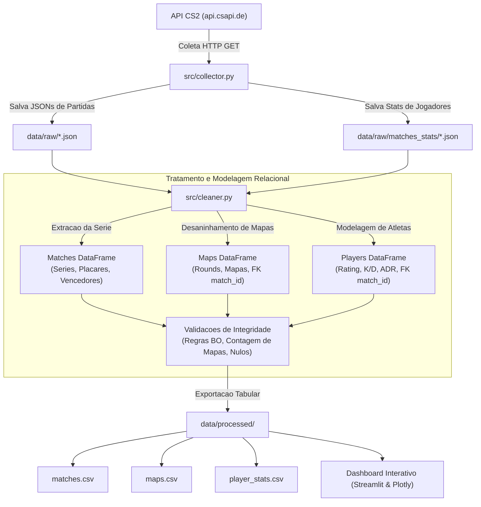

# CS2 Data Analysis - Pipeline & Analytics

[](https://www.python.org/)
[]()
[]()

Pipeline automatizado de **Engenharia e Analise de Dados** para o cenario profissional de **Counter-Strike 2 (CS2)**. O projeto extrai dados competitivos das principais equipes globais via API publica, normaliza estruturas aninhadas, realiza modelagem relacional (separando series, mapas e atletas) e gera datasets limpos para analises de desempenho e visualizacao em dashboard interativo.

---

## Sumario

- [Sobre o Projeto](#sobre-o-projeto)
- [Arquitetura de Dados](#arquitetura-de-dados)
- [O que acontece quando o codigo e executado?](#o-que-acontece-quando-o-codigo-e-executado)
  - [Comportamento da Base de Dados (Snapshot vs Incremental)](#comportamento-da-base-de-dados)
- [Dicionario de Dados](#dicionario-de-dados)
- [Como Executar o Projeto](#como-executar-o-projeto)
  - [Pre-requisitos](#pre-requisitos)
  - [Instalacao Passo a Passo](#instalacao-passo-a-passo)
  - [Comandos de Execucao](#comandos-de-execucao)
- [Estrutura de Pastas](#estrutura-de-pastas)
- [Roadmap do Projeto](#roadmap-do-projeto)
- [Autor](#autor)

---

## Sobre o Projeto

No Counter-Strike profissional, decisoes taticas e analise de adversarios (*scouting*) dependem fortemente de dados: taxas de vitoria por mapa (*winrate*), conversao de rounds, margem de vitoria, impacto individual de jogadores (*rating* e *swing*) e estabilidade contra adversarios de diferentes faixas de ranking.

Este projeto resolve o desafio de coletar, estruturar e validar dados da API publica `api.csapi.de`, transformando respostas JSON complexas e aninhadas em tres tabelas relacionais prontas para consumo analitico:
1. **`matches.csv`**: Visao da partida/serie (MD1, MD3, MD5).
2. **`maps.csv`**: Visao detalhada de cada mapa jogado dentro de cada serie.
3. **`player_stats.csv`**: Estatisticas individuais de desempenho dos atletas (Kills, Deaths, K/D, Rating 2.0, ADR, KAST e Impact Swing).

### Equipes Monitoradas
- **Spirit** (ID: `7020`)
- **MOUZ** (ID: `4494`)
- **Falcons** (ID: `11283`)
- **FUT Esports** (ID: `13286`)
- **Vitality** (ID: `9565`)
- **FURIA** (ID: `8297`)

---

## Arquitetura de Dados



---

## O que acontece quando o codigo e executado?

O projeto e orquestrado pelo script [`run_pipeline.py`](run_pipeline.py). Ao rodar o comando:

1. **Etapa 1: Coleta das Partidas (`src/collector.py`)**
   - Consulta o endpoint `/teams/{team_id}/matchhistory?limit=20` para cada equipe.
   - Utiliza controle de timeout (15s) e grava a resposta em `data/raw/{team_name}.json`.
2. **Etapa 2: Coleta de Estatisticas dos Jogadores**
   - Consulta o endpoint `/matches/{match_id}/stats` para cada partida coletada.
   - Utiliza cache local em `data/raw/matches_stats/` e politica de retry com backoff exponencial caso receba rate limit (HTTP 429).
3. **Etapa 3: Normalizacao e Desduplicacao (`src/cleaner.py`)**
   - Aplica `pd.json_normalize` para achatar chaves aninhadas (`team1.name`, `team2.rank`, etc.).
   - Executa `drop_duplicates(subset="match_id")`, garantindo que confrontos diretos entre times monitorados aparecam exatamente uma vez.
4. **Etapa 4: Engenharia de Features e Modelagem Relacional**
   - Cria indicadores de vitoria (`team1_result`, `team2_result`, `map_winner_name`).
   - Calcula saldo de mapas, saldo de rounds e metricas individuais de cada atleta (K/D ratio, saldo de abates, rating).
5. **Etapa 5: Validacao de Sanidade**
   - Confere se partidas MD1 possuem 1 mapa, MD3 possuem 2 ou 3 mapas e MD5 possuem 3 a 5 mapas.
   - Valida ausencia de valores nulos nas 3 tabelas.
6. **Etapa 6: Carga e Salvamento**
   - Salva os arquivos finais tratados em `data/processed/matches.csv`, `maps.csv` e `player_stats.csv`.

---

### Comportamento da Base de Dados

> **Pergunta frequente:** *A base de dados aumenta a cada execucao ou ela apenas atualiza os dados existentes?*

No modelo atual, a base funciona no padrao **Snapshot com Janela Deslizante**:
* A API fornece as **ultimas 20 partidas** de cada equipe.
* Quando o pipeline e executado, os arquivos em `data/raw/` e `data/processed/` sao **atualizados com o estado mais recente**.
* Se um time disputar uma nova partida hoje, ela entra na base e a 21ª partida mais antiga e rotacionada para fora. A base mantem um tamanho estavel de **~120 partidas unicas**, **~290 mapas** e **1.200 registros de atletas**.

Nota de Evolucao Tecnica: Para transformar este pipeline em um modelo **Incremental Acumulativo** (que nunca perde historico passado), basta configurar o salvamento para mesclar as novas partidas com o CSV ja existente atraves de um `concat` seguido de `drop_duplicates(subset="match_id")`.

---

## 📊 Dicionário de Dados

### 1. `matches.csv` (Entidade Partida / Série)
| Coluna | Tipo | Descrição |
| :--- | :--- | :--- |
| `match_id` | `int64` | Identificador único da partida (**Chave Primária**) |
| `best_of` | `int64` | Formato da série (1 para MD1, 3 para MD3, 5 para MD5) |
| `date` | `datetime64` | Data em que a partida ocorreu |
| `event` | `string` | Nome do torneio/campeonato |
| `team1_id` / `team2_id` | `int64` | Identificadores numéricos das equipes |
| `team1_name` / `team2_name` | `string` | Nomes das equipes |
| `team1_score` / `team2_score` | `int64` | Mapas vencidos por cada equipe na série |
| `team1_rank` / `team2_rank` | `int64` | Posição no ranking mundial no momento da partida |
| `winner_id` / `winner_name` | `int64` / `string` | Equipe vencedora da série |
| `team1_result` / `team2_result` | `string` | Resultado da equipe: `'W'` (vitória) ou `'L'` (derrota) |
| `score_difference` | `int64` | Saldo absoluto de mapas (ex: 2-0 -> 2, 2-1 -> 1) |

### 2. `maps.csv` (Entidade Mapa Individual)
| Coluna | Tipo | Descrição |
| :--- | :--- | :--- |
| `match_id` | `int64` | ID da partida correspondente (**Chave Estrangeira**) |
| `map_id` | `int64` | Identificador do mapa |
| `map_name` | `string` | Nome do mapa jogado (ex: Dust2, Mirage, Nuke, Ancient) |
| `team1_id` / `team2_id` | `int64` | IDs dos times no confronto |
| `team1_name` / `team2_name` | `string` | Nomes dos times no confronto |
| `team1_map_score` | `int64` | Pontuação de rounds do Team 1 no mapa |
| `team2_map_score` | `int64` | Pontuação de rounds do Team 2 no mapa |
| `map_winner_id` | `int64` | ID da equipe vencedora do mapa |
| `map_winner_name` | `string` | Nome da equipe vencedora do mapa |
| `round_difference` | `int64` | Diferença de rounds entre as equipes no mapa |

### 3. `player_stats.csv` (Entidade Estatísticas Individuais de Jogadores)
| Coluna | Tipo | Descrição |
| :--- | :--- | :--- |
| `match_id` | `int64` | ID da partida correspondente (**Chave Estrangeira**) |
| `date` | `datetime64` | Data da partida |
| `event` | `string` | Campeonato / Torneio |
| `team_id` / `team_name` | `int64` / `string` | Equipe do jogador |
| `player_id` | `int64` | ID numérico do jogador na base oficial |
| `player_name` | `string` | Nickname profissional (ex: `donk`, `zywoo`, `m0nesy`) |
| `kills` (`k`) | `int64` | Total de eliminações na série |
| `deaths` (`d`) | `int64` | Total de mortes na série |
| `kd_ratio` | `float64` | Razão Kills / Deaths ($K/D$) |
| `kd_diff` | `int64` | Saldo de abates ($K - D$) |
| `rating` | `float64` | Performance rating oficial CS2 (HLTV 2.0) |
| `adr` | `float64` | Dano médio causado por round (*Average Damage per Round*) |
| `kast` | `float64` | Porcentagem de rounds com Kill, Assist, Sobrevivência ou Trade |
| `impact_swing` | `float64` | Métrica de impacto em rounds decisivos / embreagem |

---

## 🚀 Como Executar o Projeto

### Pré-requisitos
- Python 3.10 ou superior
- Git instalado

### Instalação Passo a Passo

1. **Clone o repositório:**
```bash
git clone https://github.com/cstmateuzx/CS2-Data-Analysis.git
cd CS2-Data-Analysis
```

2. **Crie e ative um ambiente virtual:**
- **No Windows (PowerShell):**
  ```powershell
  python -m venv .venv
  .venv\Scripts\Activate.ps1
  ```
- **No Linux/macOS:**
  ```bash
  python3 -m venv .venv
  source .venv/bin/activate
  ```

3. **Instale as dependências:**
```bash
pip install -r requirements.txt
```

### Comandos de Execução

#### Opção A: Executar o Pipeline Completo (Coleta da API + Limpeza)
Requisita novas partidas da API, atualiza os arquivos brutos e gera os CSVs:
```bash
python run_pipeline.py
```

#### Opção B: Executar Apenas a Limpeza (Usando Dados Locais)
Útil para processar rapidamente ou quando estiver sem conexão com a internet:
```bash
python run_pipeline.py --skip-collect
```

#### Opção C: Ajustar Limite de Partidas por Equipe
Para coletar mais ou menos partidas por equipe:
```bash
python run_pipeline.py --limit 30
```

#### Opção D: Abrir o Dashboard Web Interativo (Streamlit)
Inicia o dashboard analítico completo com filtros, tabelas e gráficos no seu navegador:
```bash
streamlit run dashboard/app.py
```

---

## 📁 Estrutura de Pastas

```text
CS2-Data-Analysis/
│
├── data/
│   ├── raw/                  # Arquivos JSON brutos coletados da API
│   │   └── matches_stats/    # Estatísticas detalhadas de cada partida
│   └── processed/            # Datasets tratados finais (matches.csv, maps.csv, player_stats.csv)
│
├── src/                      # Módulos do código-fonte
│   ├── __init__.py           # Inicializador do pacote Python
│   ├── config.py             # Configurações globais, paths e constantes
│   ├── collector.py          # Coleta e integração com a API de CS2
│   └── cleaner.py            # Limpeza, normalização, modelagem e validações
│
├── data_cleaning/            # Jupyter Notebooks de desenvolvimento e testes
│   ├── clean_data.ipynb      # Notebook original de estudo e experimentação
│   └── testes_finais.ipynb   # Notebook de validação e testes estatísticos
│
├── dashboard/                # Interface web interativa (Streamlit)
│   └── app.py                # Código da aplicação Streamlit com Plotly
├── exploratory_analysis/     # Análises exploratórias de dados (EDA)
│
├── run_pipeline.py           # Orquestrador CLI de execução do pipeline
├── requirements.txt          # Dependências do projeto
├── .gitignore                # Regras de exclusão do controle de versão
└── README.md                 # Documentação técnica do projeto
```

---

## 🗺️ Roadmap do Projeto

- [x] Extração de dados da API pública de CS2
- [x] Normalização de JSON e tratamento de nulos/tipos
- [x] Modelagem relacional separando Séries (`matches`), Mapas (`maps`) e Jogadores (`player_stats`)
- [x] Validação de consistência lógica (BO vs Maps count e integridade de nulos)
- [x] Modularização do pipeline em scripts Python estruturados
- [x] Documentação técnica completa e padronização com `.gitignore` e `requirements.txt`
- [x] Coleta e estruturação de métricas individuais de jogadores (Rating, K/D, ADR, KAST, Swing)
- [x] Matriz de Dominância e Rankings por Mapa
- [x] Dashboard interativo em **Streamlit & Plotly** ([`dashboard/app.py`](dashboard/app.py))
- [ ] Testes automatizados com **Pytest**
- [ ] Pipeline de CI via **GitHub Actions**

---

## 👤 Autor

Desenvolvido por **Mateus (cstmateuzx)**  
Projeto focado em Engenharia e Análise de Dados em eSports.  
Sinta-se à vontade para conectar e colaborar!
